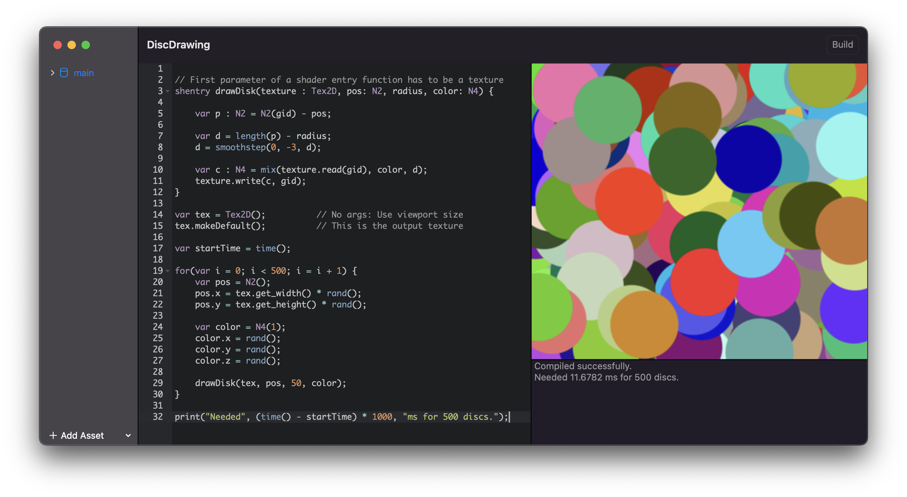

# DenrimScript



DenrimScript is a scripting language for the Apple and Metal ecosystem, written in Swift and includes optional GPU compute shader support. 

## Abstract

DenrimScript is designed to be used as a scripting language for Swift based applications, it is easy to add native Swift functions or classes to the language.

However it's main aim is to bring the CPU and GPU together in one language and to pass data between the CPU and GPU on the fly.

If you have a fast language which supports both CPU and GPU features, you can create a dynamic ecosystem of language features for app and game development which is my ultimate goal.

The GPU part is completely optional if you just need a native Swift based scripting language.
 
DenrimScript is implemented as a bytecode based virtual machine and is 100% written in Swift.

It's name comes from the fact that I want to use it in v2 of my game and app creator app [Denrim](https://github.com/markusmoenig/Denrim) which is currently utilizing text based behavior trees. It will also be used in my upcoming SDF modeling package [Signed](https://github.com/markusmoenig/Signed) and will replace Lua.

## Current Status

DenrimScript is under development and language features may change. Also robustness and error messages have to be improved before release. See the missing features section below.

## Overview

As a scripting language DenrimScript is more or less full featured, with some features partially implemented. See the missing features list below.

Calculate the 10th Fibonacci number and print it: 

```c
fn fib(n) {
    if (n < 2) return n;
    return fib(n - 2) + fib(n - 1);
}

print fib(20);
```

Control flows

```c
// While loop
var whileLoop = 10;

while (whileLoop >= 0) {
    whileLoop = whileLoop - 1;
}

// For loop
for(var i = 0; i < 10; i = i + 1) {}
```

Classes

```c
class Dispenser {

    // Constructor
    init(beverage) {
        this.beverage = beverage;
    }
    
    getSome() {
        print "Enjoy some " + this.beverage + "!";
    }
}

var dispenser = Dispenser("Tea")
dispenser.getSome();
dispenser = nil;
```

DenrimScript is dynamically typed, but I will add support for defining types later for the GPU support.

## Usage

Add the URL of this repository to your Swift Packages in XCode.

```swift
import DenrimScript

let denrim = DenrimScript()

let errors = denrim.compile(code: "print 3 + 7")
if errors.isEmpty {
    denrim.execute()
}
```

If you want to enable GPU support you have to pass a reference to an *MTKView* to the DenrimScript constructor. After execution the output texture is referenced via the public resultTexture member of DenrimScript.

Adding a native, global function:

```swift
script.registerFn(name: "nativeAdd", fn: add)

func add(_ args: [Object],_ instance: ObjectInstance?) -> Object {        
    if let instance = instance {
        // Reference to the class instance if this is a method
    }
        
    if args.count == 2 {
        if let num1 = args[0].asNumber(), let num2 = args[1].asNumber() {
            return .number(num1 + num2)
        }
    }
    return .NIL()
}
```

Which can then be used inside DenrimScript:

```c
print nativeAdd(3, 4);
```

Registering a class and a class method:

```Swift
let mathClass = script.registerClass(name: "Math"))

script.registerClassMethod(classObject: mathClass, name: "add", fn: add)
```

When you add a method named "init" it will be treated as the constructor for the class. Note that the instance object has a property called **native** (of type Any) where you can store Swift side data in the constructor and access during method calls.

## GPU Support

If you passed the reference to an MTKView to the DenrimScript constructor you can run compute shaders on the GPU.

You can do this by labelling your function **sh** or **shentry** instead of **fn**, the later functions can be called from the CPU section of your script, while **sh** functions can only be called from other shader functions.

**shentry** functions need a texture as the first parameter. A special parameter **gid** is available inside shentry functions and contains the grid id of the current pixel.

See the screenshot of the disc drawing example of how to use the gid to read and write pixel data from textures.

DenrimScript is dynamically typed, however Metal is statically typed. You have to type each variable, here is a list of the currently available types and the corresponding metal types.

```
var number == float
var vector : N2 == float2
var vector : N3 == float3
var vector : N4 == float4
var tex : Tex2D == texture2d<float, access::read_write>
```

Note that the same classes on the CPU side reference double values!

## Missing Features

* No function scoping yet, coming soon.
* No class inheritance yet, coming soon.
* No arrays, would be nice to have but the whole idea is to use the GPU later for operations on arrays.
* Make the GPU support more robust with type checking during compile time and better error messages.
* Shader functions emulation on the CPU (smoothstep etc)

## Acknowledgements

Robert Nystrom for the fantastic book [Crafting Interpreters](https://craftinginterpreters.com). DenrimScript is based on the C implementation of Lox. If you are interested in interpreters and compilers this is a must read.
